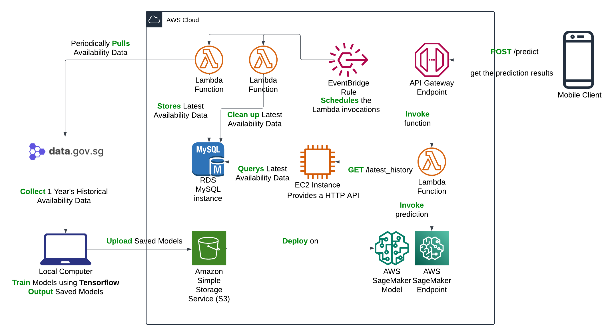

# Smart Parking System

Group Member:

- Wang, Huijia
- Wang, Ke
- Zhang, Tianhao
- Sun, Yuming

Supervisor:

- Prof. Nascimento, Mario
- Prof. Singh, Sarita

## Introduction

This is a mobile application developed using the React Native framework.
The app leverages public parking data provided by the Singapore government to train an LSTM (Long Short-Term Memory) machine learning model, which is deployed on AWS cloud services. Users can select their intended destination, and based on their driving time, the app provides predictive parking availability or real-time parking space information for nearby parking lots to assist with decision-making. Once a parking option is chosen, users are directed to Google Maps for navigation to their destination.

---

Our project consists of three parts.

### A mobile application

   For details of this part, please refer to the [SmartParkingMobile](/SmartParkingMobile) directory.

### Machine Learning Model

   For details of this part, please refer to the [ML](/ML) directory.

### AWS Backend 

It consists of these following services: 
- AWS Lambda (three Lambdas)
- AWS API Gateway
- AWS RDS MySQL
- AWS S3
- AWS EventBridge Rules
- AWS EC2
- AWS SageMaker (Model and Endpoint)

For details of this part, please refer to the [AWS](/AWS) directory.

## Overall System Architecture
The architecture of the project is as follows:
        

## Data used for training the model
### Parking Availability Data
Nearly 2000 files of parking availability data were collected and used for training the model. 
For the sake of demonstration, only a few files are included in the [ParkingAvailability](/Data/ParkingAvailability) directory to avoid excessive usage of repo storage .

### Precipitation Data
The full precipitation data is available in the [Precipitation](/Data/Precipitation) folder.
